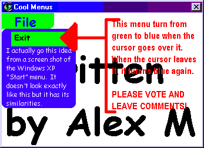



## Make AWSOME Looking Menus

### Description

This code is great if you need to spice up your program with a bit of color. It is a cool looking menu which works like any normal one. By the way, please vote and leave comments!
 
### More Info
 

             |
---                |---
**Submitted On**   |2001-12-12 16:38:10
**By**             |[Alex M](https://github.com/Planet-Source-Code/PSCIndex/blob/master/ByAuthor/alex-m.md)
**Level**          |Beginner
**User Rating**    |2.9 (20 globes from 7 users)
**Compatibility**  |VB 6\.0
**Category**       |[Custom Controls/ Forms/  Menus](https://github.com/Planet-Source-Code/PSCIndex/blob/master/ByCategory/custom-controls-forms-menus__1-4.md)
**World**          |[Visual Basic](https://github.com/Planet-Source-Code/PSCIndex/blob/master/ByWorld/visual-basic.md)
**Archive File**   |[Make\_AWSOM4159312122001\.zip](https://github.com/Planet-Source-Code/alex-m-make-awsome-looking-menus__1-29710/archive/master.zip)

